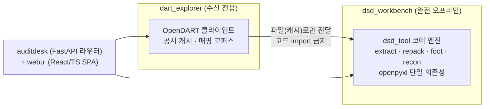

# Auditing Package

> 한국 회계감사 실무를 자동화하는 **로컬 우선(local-first) 도구 모음**.
> DART 전자공시(XBRL/DSD) 검증부터 K-IFRS 재계산, 감사 일정관리, ICFR 순서도 생성까지 —
> 감사 현장에서 반복되는 수작업을 코드로 대체합니다.

모든 도구는 회계법인 감사인의 실제 업무 흐름에서 출발했으며, 피감사 데이터를 다루는 특성상
**"완전 오프라인 · 외부 전송 금지"를 설계 원칙이 아니라 코드와 테스트로 강제**합니다.

> ⚠️ 이 저장소의 모든 예시·스크린샷·시드 데이터는 더미입니다(예: `㈜샘플전자`, `ABC상사`).
> 실제 클라이언트명과 재무 수치는 포함하지 않으며, 실데이터 경로는 `.gitignore`로 커밋에서 제외됩니다.

---

## 한눈에 보기

| 도구 | 무엇을 하나 | 스택 | 상태 |
|---|---|---|---|
| [**AuditDesk**](#-auditdesk--dart-xbrldsd-워크벤치) | DART 공시 DSD↔Excel 변환, Footing·전기대사·XBRL 인스턴스 대사, 계정과목→element 추천 | Python(FastAPI) + React/TS | ✅ 실전 사용 중 · 품질 게이트 30/30 통과 · 테스트 ~180개 |
| [**AuditLink**](#-auditlink--감사-일정관리-데스크톱-앱) | FY→클라이언트→계정과목→할일 트리로 감사 engagement·PBC·ICFR 통합 관리 | React 19 + FastAPI + SQLite + PyWebView | ✅ 기능 완결 · pytest 58개 |
| [**Audit Toolbox**](#-audit-toolbox--k-ifrs-재계산--감사-보조) | K-IFRS 1116(리스) 재계산 9종, 감가상각 재계산, 조회 모집단 완전성 검증, PDF/OCR 유틸 | Python + Streamlit | ✅ 13개 페이지 가동 · 테스트 43개 |
| [**ICFR Flowchart**](#-icfr-flowchart-generator) | RCM 엑셀 → 표준 업무흐름도 자동 생성 → 캔버스 편집 → PPT 내보내기 | React 18 + TS + React Flow + Electron | ✅ 핵심 파이프라인 완성 |
| [**JET**](#-jet--journal-entry-test) | 시산표 검증(기초+분개장=기말) 및 분개 이상징후 시나리오 분석 | Python + Streamlit + pandas | ✅ 시나리오 4종 동작 |

---

## 공통 설계 원칙

1. **수신 허용, 송신 금지** — 공개 데이터(DART 공시)는 받아오되, 고객사 데이터는 어떤 경로로도 외부에 나가지 않습니다.
   - AuditDesk 코어 엔진은 네트워크 모듈(`requests`/`httpx`/`socket` 등) import 자체를 **테스트가 소스 전수 스캔으로 차단**
   - Flowchart의 Electron 셸은 `onBeforeRequest`로 로컬 외 모든 네트워크 요청 차단
   - 서버는 전부 `127.0.0.1` 바인딩 하드코딩
2. **자동은 추천, 확정은 회계사** — 자동 탐지·매핑 결과는 1차 추천일 뿐, 산출물에 `확정☐` 열을 두어 사람의 최종 판단을 강제합니다.
3. **미매칭 ≠ 0** — 대사·매핑에서 걸러지지 않은 항목을 숨기지 않고 별도 시트로 노출합니다.
4. **추적 가능한 품질** — 요청 대장 → 스펙 → 품질 게이트 → 구현 파일 → 테스트가 문서로 상호 추적됩니다.

---

## 배포 규약

**배치 런처(`run.bat`·`RUN.bat` 류)는 ASCII 전용으로 작성한다. 한글 메시지는 파이썬 쪽에서 출력한다.**

근거 (DSD_footing 실측, 2026-08-10):

- 배치를 UTF-8로 저장하고 안에서 `chcp 65001`을 실행하면, cmd가 코드페이지 전환 시점에
  파일 오프셋을 문자 단위로 재계산하면서 **줄이 어긋나 엉뚱한 줄을 명령으로 실행**한다
  (실측: 사용법 안내의 예시 줄 `run.bat "C:\경로\..."`가 명령으로 실행되어
  `'run.bat' is not recognized` 오류 발생).
- 반대로 CP949(ANSI)로 저장해도 콘솔이 이미 65001이면 한글 바이트가 invalid UTF-8이 되어
  **같은 방식으로 파서가 어긋난다** (실측: `@echo off`가 `'ho' is not recognized`로 깨짐).
- 즉 어느 인코딩을 선택해도 **사용자 콘솔의 코드페이지에 따라 깨질 수 있다.**
  배치에서 비ASCII 문자를 제거하는 것만이 양쪽 모두에서 안전하다.

체크리스트: ① 배치 파일에 한글·특수문자 금지(주석 포함) ② `chcp` 사용 금지
③ 모든 변수 참조에 따옴표(`"%~1"`, `"%~dp0"`) — 공백·한글·OneDrive 경로 대응
④ 안내·오류 메시지는 배치가 아니라 호출되는 파이썬 스크립트에서 출력.

---

## 🏛 AuditDesk — DART XBRL/DSD 워크벤치

`auditdesk/` · **가장 규모가 크고 활발히 개발 중인 주력 도구** (Python ~16K LOC, TS/JSX ~8K LOC)

감사보고서 전자공시(DSD·XBRL) 작성·검증 실무를 지원합니다. 최종 산출물은 금감원 편집기에
전사할 수 있는 **가이드 엑셀**이며, 편집기 업로드·IXD 직접 생성은 의도적으로 범위에서 제외했습니다.

### 기능 축 4개

| 축 | 내용 |
|---|---|
| **DSD ↔ Excel 양방향 변환** | DSD에서 재무제표·주석을 Excel로 추출하고, 편집된 셀만 **XML 바이트 오프셋 기반으로 정밀 역교체(repack)**. 찾아치환이 아닌 오프셋 방식이라 중복값 오교체가 구조적으로 불가능 |
| **검증 3종** | ① Footing(합계검증·주석대사) ② 전기대사(당기 보고서 전기열 ↔ 전기 보고서 당기열) ③ DSD ↔ XBRL 인스턴스 대사(태깅 최종 검증) |
| **XBRL 작성 지원** | 상장사 약 4,000사 공시 코퍼스 기반 계정과목→element 추천(Top-4, **LLM 미사용**), 주석 role·축(axis) 매핑, 전기 인스턴스 승계·롤포워드 스캐폴드 |
| **DART 수신·탐색** | OpenDART API 공시 검색, XBRL 수신, 차원표 렌더, 택소노미 버전 diff |

### 아키텍처 — 신뢰 경계로 분리된 두 앱



- 오프라인 경계는 문서가 아니라 **`test_offline.py`가 자동 강제** — 코어 소스에 네트워크 모듈이 유입되면 테스트가 실패합니다.
- 진척 관리는 `GATES.json`(패치별 품질 게이트 대장)이 단일 소스이며, 게이트마다 정량 근거(홀드아웃 정확도, 바이트 일치 여부 등)를 기록합니다. 현재 **30개 게이트 전부 통과**.
- 읽기 전용 관제 대시보드(`dashboard/`, port 8700)가 게이트·테스트·코퍼스 진행률을 렌더합니다.

### 실행

```bash
# 원클릭 (프런트 자동 빌드 → 서버 기동 → 브라우저 오픈)
RUN.bat
```

```bash
# CLI 직접 사용 예 (더미 파일명)
cd auditdesk/dsd_workbench
python -m dsd_tool extract 샘플전자_반기보고서.dsd
python -m dsd_tool foot 샘플전자_재무제표.xlsx
```

> `dart_explorer`는 OpenDART API 키(무료 발급)를 `.env`에 설정해야 합니다.

---

## 📋 AuditLink — 감사 일정관리 데스크톱 앱

`auditlink/` · React 19 + Vite + Tailwind 4 / FastAPI + SQLite(aiosqlite) / PyWebView → PyInstaller EXE

감사 시즌의 engagement를 `FY → 클라이언트 → Phase(기중/기말) → 계정과목 → 할일` 트리로 관리하는
완전 오프라인 데스크톱 앱입니다.

**주요 화면 (5개 라우트)**

- **대시보드** — 전체 진척률, 마감임박 D-day, ICFR 완료율, 월간·주간 캘린더(더블클릭 빠른 추가)
- **감사업무** — 트리 네비게이션(드래그앤드롭·우클릭 CRUD), 할일 리스트/칸반, 요청자료(PBC) 관리, 인터뷰 기록
- **템플릿** — 업종별 감사 템플릿, 엑셀 체크리스트 업로드/내보내기
- **내부회계(ICFR)** — 테스트 추적 테이블 + 필터
- **설정** — FY 관리, 알림 기준, 백업/복원

전역 검색(`Ctrl+K`, 결과 클릭 시 트리 자동 확장), 기한초과·검토대기 알림 드롭다운 포함.
백엔드는 REST 엔드포인트 약 70개, **pytest 58개 전체 통과**.

```bash
# 개발 실행
start_auditlink.bat

# 단일 EXE 빌드 (React 빌드 → PyInstaller 번들)
build.bat   # → dist/AuditLink.exe
```

---

## 🧰 Audit Toolbox — K-IFRS 재계산 & 감사 보조

`audit_toolbox/` · Python + Streamlit 멀티페이지 (13개 페이지)

회사 원장 엑셀 업로드 → 컬럼 매핑 → **K-IFRS 기준 재계산** → 회사값과 차이 분석 → 워크페이퍼용
엑셀 다운로드가 공통 흐름입니다. 런처 첫 화면에서 "외부 전송 없음"을 `netstat` 확인 방법까지 안내합니다.

**① 리스(K-IFRS 1116) 재계산 — 기준서 조문 단위 9개 페이지**

리스 식별(문단 9~11) · 단기/소액 면제(5~8) · 할인율 산정 문서화(26) · **리스부채/사용권자산 재계산(코어)** ·
변동리스료 재측정(27, 38) · 리스변경 4개 시나리오(44~46) · 리스제공자 분류(61~84) · 판매후리스백(98~103) · 전대리스(B58)

**② 유형자산 감가상각 재계산** — 원장 매핑 → 재계산 → 차이분석 → 엑셀

**③ 조회 모집단 완전성 검증 — 가장 성숙한 모듈 (테스트 43개)**

분개장·명세서에서 금융기관 거래를 3중 레이어(명칭 사전 → 금융 흔적 계정 → 정규화 롤업)로 탐지해
**외부조회 대상 모집단의 누락을 검증**합니다.

- 온라인 전자조회 참가기관 테이블 내장 → 온라인/서면 조회 자동 판정
- ERP(더존) 머리글 다중행·관리항목 분산 거래처 대응, 매핑 프로파일 자동 재사용
- 프로파일 저장 시 **화이트리스트로 컬럼명 메타데이터만 저장** — 재무수치·거래처명은 저장 단계에서 폐기
- 금융기관 사전은 외부 엑셀로 분리되어 회계사가 코드 수정 없이 갱신 가능

**④ 실무 유틸** — PDF 일괄 리네임·도장 삽입·페이지번호, 의사록 OCR(EasyOCR, 완전 로컬) → 엑셀 정리

```bash
run.bat   # .venv 자동 구성 → streamlit run (localhost 전용)
```

---

## 🔀 ICFR Flowchart Generator

`flowchart/` · Vite + React 18 + TypeScript + React Flow + pptxgenjs / Electron 포터블 EXE

내부회계관리제도(ICFR) 평가용 **표준 업무흐름도를 RCM 엑셀에서 자동 생성**하고, 캔버스에서
도형 드래그·연결선 재배치로 리뷰 코멘트에 즉시 대응한 뒤 **PPT로 내보내는** 도구입니다.

- **엑셀 파싱** — 컬럼 별칭 매칭, 병합셀 그룹헤더 처리, 다중 flowchart 자동 생성
- **캔버스 편집** — 도형 팔레트 11종(활동/분기/문서/Risk/Key·Non-Key 통제 등), undo/redo, 복사/붙여넣기, 노드 잠금, 단축키 시스템
- **PPT 내보내기** — 4:3 슬라이드에 헤더 테이블·도형·연결선을 사내 표준 서식 그대로 렌더
- **보안 하드닝** — 100% 브라우저 내 처리(백엔드 없음). Electron 셸은 sandbox + contextIsolation + 외부 네트워크 요청 전면 차단

```bash
npm install && npm run dev       # 개발 서버
npm run electron:build           # 포터블 EXE
```

---

## 🔍 JET — Journal Entry Test

루트 `streamlit_app.py` + `logic_jet.py` + `logic_comparison.py` · Streamlit + pandas

전기 시산표·분개장·당기 시산표 CSV를 업로드해 **`기초 + 분개장 = 기말` 등식을 검증**하고
분개 이상징후를 분석하는 경량 도구입니다. 이 저장소의 출발점이 된 첫 도구이기도 합니다.

| 시나리오 | 내용 |
|---|---|
| A02 | 전표 차/대변 일치 검증 |
| A03 | 시산표 Reconciliation (기초+분개장=기말, 차이 계정 드릴다운) |
| JS001 | 매출/매입 동시 발생 거래처 분석 |
| JS006 | 비경상적 월 매출 트렌드 분석 |

```bash
pip install -r requirements.txt
streamlit run streamlit_app.py
```

---

## 저장소 구조

```
Auditing_Package/
├─ auditdesk/          # [주력] DART XBRL/DSD 워크벤치
│  ├─ dsd_workbench/   #   오프라인 코어 엔진 (extract/repack/foot/recon, 테스트 ~97개)
│  ├─ dart_explorer/   #   OpenDART 수신·택소노미·매핑 코퍼스 (테스트 ~44개)
│  ├─ auditdesk/       #   FastAPI 라우터층 (REST 43개) + SPA 서빙
│  ├─ webui/           #   React/TS 프런트엔드
│  ├─ dashboard/       #   읽기 전용 관제 대시보드
│  ├─ docs/            #   사용설명서 · 스펙 9종 · 구현 추적 매트릭스
│  └─ GATES.json       #   패치별 품질 게이트 대장 (30/30 통과)
├─ auditlink/          # 감사 일정관리 데스크톱 앱 (React+FastAPI+PyWebView)
├─ audit_toolbox/      # K-IFRS 재계산 & 감사 보조 (Streamlit 13페이지)
├─ flowchart/          # ICFR 순서도 생성기 (React Flow+Electron)
├─ streamlit_app.py    # JET — Journal Entry Test
└─ logic_jet.py / logic_comparison.py
```

---

## 로드맵

- **AuditDesk** — 금감원 XBRL 작성가이드 규칙 자산화(F-4a) → 가이드 체크 시트(F-4b) → 반기보고서 시즌 실전 투입
- **Audit Toolbox** — 리스 재계산 코어(`calc_lease`) 자동화 테스트 확충, 5~9번 페이지 엑셀 다운로드 연결
- **Flowchart** — 매핑 시트 역내보내기, `.flow.json` 프로젝트 파일 저장
- **통합** — AuditLink를 AuditDesk 셸로 통합 (시즌 후 검토)

## 데이터 취급

- 저장소에는 실제 클라이언트 데이터를 커밋하지 않습니다. 실무 산출물·세션 DB·공시 캐시 경로는 `.gitignore`로 제외됩니다.
- 데모·테스트 픽스처는 전부 합성(더미) 데이터이며, 코드 주석과 docstring에 가상 데이터임을 명시합니다.
- 모든 서버는 `127.0.0.1` 전용이며 사용량 통계 수집을 포함한 일체의 외부 전송이 없습니다.
