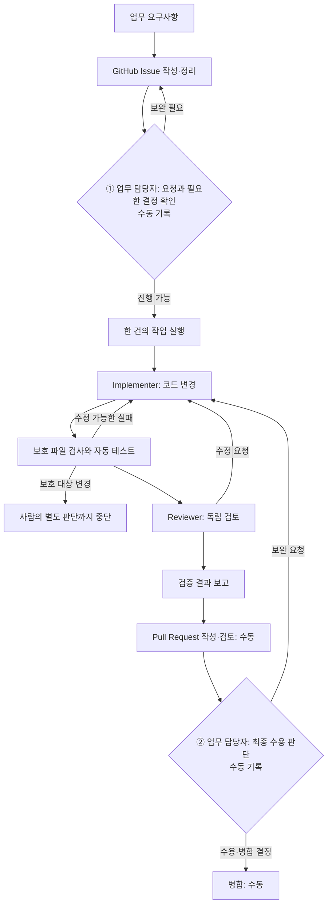
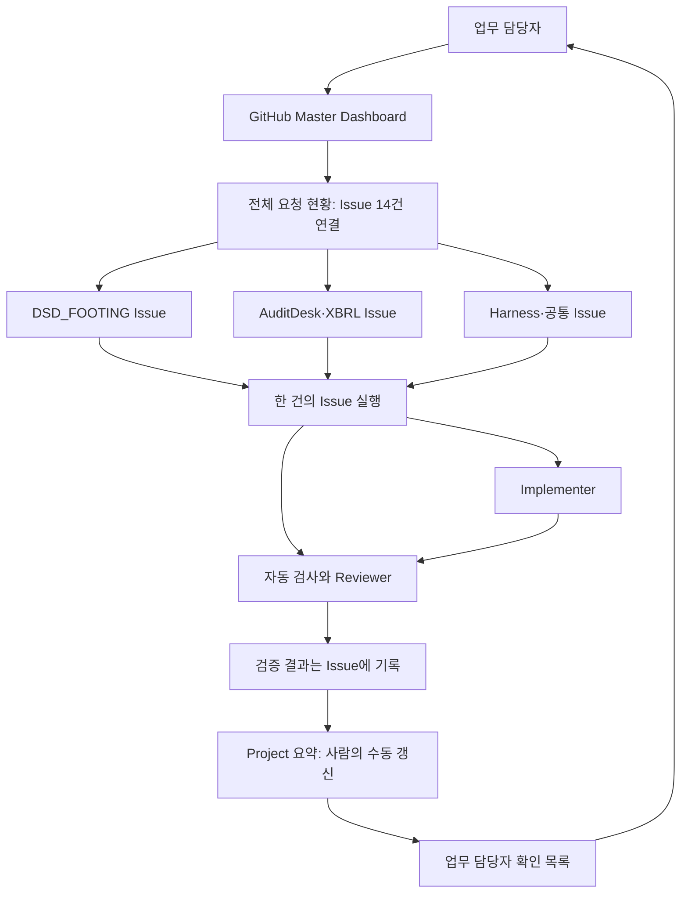

# 개발 작업 Harness 구조

업무 요청을 Issue에 기록하고, 사람이 필요한 결정을 내립니다. 도구는 한 건의 변경·검사·독립 검토를 진행합니다. 최종 수용과 병합은 사람이 맡습니다.



**두 사람 확인 지점은 자동 승인 기능이 아닙니다.** 첫 지점에서 Issue의 업무 내용과 필요한 결정을 확인합니다. 실행 도구는 Issue에 미결정 항목이 명시되면 멈추지만, 모든 Issue의 최초 승인 댓글을 일률적으로 강제하지는 않습니다. 둘째 지점에서 검증 결과와 Pull Request를 보고 최종 수용 여부를 결정합니다. Pull Request는 결과를 인계하기 위해 최종 수용 전에 열릴 수 있습니다. 자동 병합은 없습니다.

## A. 한눈에 보는 Harness

Harness는 요청, 지켜야 할 기준, 검사 결과와 사람의 결정을 연결하는 개발 절차입니다. 업무 담당자는 Issue를 확인하고 업무상 결정을 기록하며 마지막에 결과를 수용할지 판단합니다. Implementer는 코드를 바꾸고, 별도 Reviewer는 변경과 검사 증거를 읽기 전용으로 검토합니다. 자동 검사는 보호 대상 변경, 제품별 테스트와 기록된 기준의 차이를 확인합니다. 결과물은 변경 코드, 검사 기록, 검토 결과, 보고서와 Pull Request입니다. 검사 통과는 업무 승인을 대신하지 않습니다.

## B. 전체 Workflow와 자동화 경계

위 그림은 권장 업무 흐름입니다. 현재 [`scripts/orchestrator.py`](../../scripts/orchestrator.py)는 이미 작성된 **열린 Issue 한 건**을 읽어 Implementer → 보호 검사·필수 검사·회귀 검사 → 읽기 전용 Reviewer → JSON 결과 보고까지 실행할 수 있습니다. 승인 대기나 보호 대상 변경에서는 중단합니다. 수정 가능한 실패에는 제한된 재작업을 허용합니다. 기존의 알려진 검사 공백은 새 문제와 구분해 보고하며, 이를 전체 기술 검증 통과라고 부르지 않습니다. Issue 생성, 모든 최초 승인 기록 확인, Project 이동, Pull Request 생성, 업무 최종 승인과 병합은 자동화하지 않았습니다. 실행 조건은 [Orchestrator MVP](orchestrator_mvp.md)에 있습니다.

## C. 구성요소별 역할

| 구성요소 | 역할 | 실제 구현 위치와 범위 |
| --- | --- | --- |
| Governance | 공통 정책, 보호 대상, 승인 경계 | [`governance/POLICY.md`](../../governance/POLICY.md), [`governance/PROTECTED_ARTIFACTS.md`](../../governance/PROTECTED_ARTIFACTS.md), [`scripts/check_protected.py`](../../scripts/check_protected.py) |
| Agent Instructions | 공통 및 제품별 행동 규칙 | [`AGENTS.md`](../../AGENTS.md), [`auditdesk/AGENTS.md`](../../auditdesk/AGENTS.md), [`DSD_footing/AGENTS.md`](../../DSD_footing/AGENTS.md) |
| Development Workflow | 요청부터 검증·인계까지의 절차 | [`development_workflow.md`](development_workflow.md) |
| Issue Intake | 쉬운 한국어 요약과 기술 계약 입력 | [Issue 템플릿](../../.github/ISSUE_TEMPLATE/development_task.md); 생성·정리는 수동 |
| Orchestrator | 열린 Issue 한 건의 실행·검사·검토 순서 관리 | [`scripts/orchestrator.py`](../../scripts/orchestrator.py), [`orchestrator_mvp.md`](orchestrator_mvp.md); Project 연동 없음 |
| Implementer | 독립 실행 환경에서 조사·수정 | [`scripts/orchestrator.py`](../../scripts/orchestrator.py)의 `codex exec` 호출·프롬프트; 상주 서비스 없음 |
| Automated Tests | 보호 검사, 제품별 검사, 전체 진입점 | [`scripts/check_protected.py`](../../scripts/check_protected.py), [`scripts/test_auditdesk.py`](../../scripts/test_auditdesk.py), [`scripts/test_dsd_footing.py`](../../scripts/test_dsd_footing.py), [`scripts/test_all.py`](../../scripts/test_all.py) |
| Project별 Gate | AuditDesk 테스트·웹 빌드와 DSD_FOOTING 등록 샘플 비교 | [`auditdesk/GATES.json`](../../auditdesk/GATES.json), [`DSD_footing/GATES.json`](../../DSD_footing/GATES.json); AuditDesk UI 확인은 수동 |
| Reviewer | 다른 읽기 전용 실행에서 변경·Issue·검사 증거 검토 | [`scripts/orchestrator.py`](../../scripts/orchestrator.py), [`review_protocol.md`](review_protocol.md); 업무 승인 권한 없음 |
| Verification Report | 사람용 요약과 세부 검사 증거 | [`report_template.md`](report_template.md), [`scripts/orchestrator_reporting.py`](../../scripts/orchestrator_reporting.py), [`scripts/orchestrator.py`](../../scripts/orchestrator.py); 자동 요약은 정형 결과만 설명 |
| Human Approval | 미결정 업무·보호 변경 시 중단, 최종 수용은 사람에게 인계 | [`governance/POLICY.md`](../../governance/POLICY.md), [Issue 템플릿](../../.github/ISSUE_TEMPLATE/development_task.md), [`orchestrator_mvp.md`](orchestrator_mvp.md); 기록은 수동 |
| PR | 변경·검사·위험을 함께 검토하고 인계 | [PR 템플릿](../../.github/pull_request_template.md), [GitHub Actions](../../.github/workflows/harness.yml); 자동 생성·병합 없음 |

## D. Information Flow

업무 요구사항은 사람이 [Issue 템플릿](../../.github/ISSUE_TEMPLATE/development_task.md)의 쉬운 요약과 **Developer Details**에 기록합니다. Issue가 작업·결정·상세 증거의 기준 기록이며, 실행 세션은 임시 작업 공간입니다. [Master Dashboard](https://github.com/users/yungGom/projects/1)는 각 Issue의 상태·다음 행동·담당자 확인사항을 짧게 보여 줍니다. 실행 도구는 열린 Issue의 승인·검사 계약을 읽고 Implementer에 전달합니다. Implementer 변경은 Git diff로 남습니다. 보호 검사와 제품별 검사가 증거를 만들고, Reviewer는 Issue, diff와 공식 검사 결과를 함께 봅니다. 보고서는 실패·건너뜀·기존 공백·새 문제와 검토 의견을 구분합니다. [PR 템플릿](../../.github/pull_request_template.md)은 결과를 사람에게 인계합니다. GitHub Project로의 상태 전파는 자동화되지 않아 사람이 갱신합니다. 공통 정책과 반복 검사 절차, 한 건 실행 도구는 PR #4·#25·#6으로 main에 반영됐습니다. 공개·합성 검사와 실제 자료 확인은 분리하며 자료 없음은 통과로 취급하지 않습니다. 이 현황판 문서 변경은 PR #20에서 별도 검토 대기입니다.

## E. 업무 담당자 영역과 개발자 영역

Issue와 결과 보고서의 맨 위 **한눈에 보기**에는 문제, 업무 영향, 해결 방향, 실제 변화, 확인 결과, 남은 문제와 담당자의 결정사항을 쉬운 한국어로 적습니다. 아래 **Developer Details**에는 변경 파일, 명령과 PASS/FAIL/SKIP/NOT RUN, 커밋·diff, Reviewer 의견과 보호 대상 검사 증거를 보존합니다. [Issue 템플릿](../../.github/ISSUE_TEMPLATE/development_task.md), [보고서 템플릿](report_template.md), [PR 템플릿](../../.github/pull_request_template.md)이 이 순서를 안내합니다. 자동 보고서의 일반적인 요약만으로 구체적인 업무상 수용 판단을 끝내서는 안 됩니다.

## F. 실제 파일 지도

```text
Auditing_Package/
├── AGENTS.md
├── governance/
│   ├── POLICY.md
│   ├── PROTECTED_ARTIFACTS.md
│   └── protected_paths.json
├── docs/harness/
│   ├── ARCHITECTURE.md
│   ├── HARNESS_STATUS.md
│   ├── MASTER_DASHBOARD_BACKFILL.md
│   ├── development_workflow.md
│   ├── orchestrator_mvp.md
│   ├── report_template.md
│   └── review_protocol.md
├── .github/
│   ├── ISSUE_TEMPLATE/development_task.md
│   ├── pull_request_template.md
│   └── workflows/harness.yml
├── scripts/
│   ├── orchestrator.py
│   ├── orchestrator_preflight.py
│   ├── orchestrator_results.py
│   ├── orchestrator_reporting.py
│   ├── check_protected.py
│   ├── test_auditdesk.py
│   ├── test_dsd_footing.py
│   └── test_all.py
├── auditdesk/AGENTS.md
└── DSD_footing/AGENTS.md
```

## G. 구조 변경 시 문서 동기화

Harness 단계, 승인 경계, 담당 역할, 검사 또는 보고 경로를 바꾸는 Pull Request에서는 이 문서의 그림·표·설명을 함께 검토합니다. 그래야 코드가 바뀌었는데 GitHub 구조도는 예전 동작을 설명하는 일을 막을 수 있습니다. 구현 상태가 바뀌면 [HARNESS_STATUS.md](HARNESS_STATUS.md)의 근거와 다음 단계도 갱신합니다. [PR 템플릿](../../.github/pull_request_template.md)에 확인 항목이 있습니다.

## H. 전체 개발 요청 현황판 — 실제 생성, 수동 갱신

실제 [Auditing_Package Master Dashboard](https://github.com/users/yungGom/projects/1)를 만들고 14개 Issue를 연결했습니다. DSD_FOOTING, AuditDesk, XBRL, Harness, AuditLink, Audit Toolbox 요청을 제품별 저장 화면에서 볼 수 있습니다. Master Dashboard에는 짧은 현재 상태·다음 행동·업무 담당자 확인사항만 표시합니다. 세부 결정·검사·검토 이력은 Issue에 남깁니다. [Backfill 기록과 설정](MASTER_DASHBOARD_BACKFILL.md)에 ID·상태 근거와 수동 갱신 경계를 적었습니다.



Project·필드·저장 화면·Owner Inbox는 실제로 있습니다. 새 Issue 자동 등록, 검사 결과에 따른 상태 이동, 병합 후 Done 자동 전환은 **구현되지 않았습니다**. 도구가 검사를 실행하더라도 Project에는 자동 반영되지 않으며, 사람이 Issue의 근거를 확인해 갱신해야 합니다.
