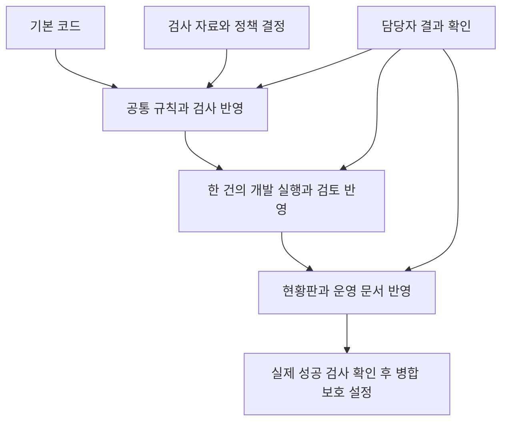

# Harness v1 마무리 계획

## 한눈에 보기

### 1. 이번에 무엇을 했나?
개발 절차를 기본 코드에 반영할 순서와 남은 문제를 다시 확인했습니다.
### 2. 실제로 무엇이 달라졌나?
담당자의 운영 방법을 정리했습니다. 검사에 쓸 임시폴더가 막혀 발생하는 오류도 별도 폴더 사용으로 해결했습니다.
### 3. 확인 결과는 어땠나?
보호 검사와 실행 도구 단위 검사는 통과했습니다. 전체 검사는 실제 파일 부족으로 아직 실패합니다.
### 4. 아직 남은 문제는?
실제 파일로 확인하는 검사 자료와 업무 승인이 필요합니다. 병합을 강제 검사로 막는 설정도 아직 없습니다.
### 5. 내가 결정해야 할 게 있나?
있음. 새 환경에서 하는 예제 검사와 실제 파일 검사를 분리할지 검토해 주세요. 기존 검사 기준은 아직 바꾸지 않았습니다.
### 6. 지금 상태는?
사람 확인 필요. 운영 준비 문서는 사용할 수 있지만 정식 운영 완료는 아닙니다.

## Developer Details

### 현재 구조

조사일: 2026-10-01. 기준은 원격 PR HEAD, 실제 diff, CI 로그와 현재 검사 코드입니다. 연결 Issue: [#23 / HARNESS-004](https://github.com/yungGom/Auditing_Package/issues/23).

| PR | 역할 | base → head | HEAD | 실제 상태 | 판정 |
| --- | --- | --- | --- | --- | --- |
| [#4](https://github.com/yungGom/Auditing_Package/pull/4) | 공통 규칙, 보호 checker, 제품별 검사, CI, CODEOWNERS | main → docs/ai-development-harness-v1 | 0d3351f | draft, MERGEABLE, protected-artifacts SUCCESS, regression FAILURE | BLOCKED |
| [#6](https://github.com/yungGom/Auditing_Package/pull/6) | Issue 한 건의 구현·검사·독립 검토·보고 실행, 구조 문서 | docs/ai-development-harness-v1 → feat/orchestrator-mvp | cfb01bd | draft, MERGEABLE, protected-artifacts SUCCESS, regression FAILURE | BLOCKED |
| [#20](https://github.com/yungGom/Auditing_Package/pull/20) | 현황판, Issue 중심 기록, 문서·운영 경계 | feat/orchestrator-mvp → codex/master-dashboard | 08e53b6 | draft, MERGEABLE, protected-artifacts SUCCESS, regression FAILURE | BLOCKED |

충돌이 없다는 MERGEABLE은 검사·업무 승인 완료를 뜻하지 않습니다. #4의 base는 현재 main을 포함합니다(조사 시 main 7cd756b와 head 간 0/4 commits). #6/#20도 실제 조상 관계와 차분으로 확인했습니다. #4 28개, #6 21개, #20 7개 파일 변경. 제품 변경을 포함하지 않는 Harness 체인이지만 전체 검사 실패는 그대로 병합 blocker입니다.

## 병합 순서

1. **PR #4**: AuditDesk의 FAIL/SKIP 해결 또는 명시적 검사 계약 재설계 승인과 후속 구현이 선행합니다. 보호 검사, checker/Harness 단위 검사, `scripts/test_all.py`, 실제 CI 성공을 확인합니다. 사람이 검사 범위·업무 수용을 기록한 뒤 초안 해제와 병합을 결정합니다. 이번 작업에서는 병합하지 않습니다.
2. **PR #6**: #4 병합 뒤 base를 main으로 변경하고 diff에서 선행 파일이 중복되지 않는지 확인합니다. squash/rebase 병합이면 선행 commit 관계가 달라지므로 임의 rebase하지 말고 새 diff를 검토합니다. Orchestrator 단위 검사, 보호 검사, 전체 검사·CI, 독립 검토를 다시 수행합니다. known-gap 상태는 Technical PASS가 아니며 전체 gate 예외가 아닙니다.
3. **PR #20**: #6 병합 뒤 base를 main으로 변경하고 최신 정책·문서 차분을 재검토합니다. 현황판 링크·필드·Inbox·수동 운영 경계, 보호 검사·전체 CI와 최종 수용을 확인합니다. closeout 후속 변경도 #20 위에 따로 검토하며 선행 실패를 우회해 병합하지 않습니다.

각 병합 후 Project와 관련 Issue를 사람이 갱신합니다. 자동 병합, 자동 상태 이동은 없습니다.

## 현재 Blocker

- B / **fixture 부재**: `test_version_check.py::test_g2_smoke_direct`는 `_KNOWN_GENERATIONS`가 비어 있으면 실패합니다. 파일은 실제 DSD 세대의 무변경 왕복 검증이며 합성 검사로 대체할 수 없습니다.
- C / **환경·자료 의존성**: DART API key, 공개 수신 캐시·코퍼스, taxonomy 두 세대, 금감원 xlsm 등이 없으면 기존 검사가 SKIP합니다. CI는 clean checkout으로 이 자료를 설치하지 않습니다. SKIP은 `test_auditdesk.py`에서 FAIL로 처리합니다.
- E / **정책 결정 필요**: 누락 DSD 3종의 공개 출처·재배포 근거가 미완결이며 기존 F1/F2/F3는 사용하지 않는 결정이 있습니다. 고객 자료를 반입하거나 기준값을 바꾸지 않습니다.
- C / **로컬 임시폴더**: 공용 pytest 임시폴더 접근 거부를 재현했습니다. Harness 전용 새 `--basetemp`로 보완했으며 기존 공용 폴더는 변경·삭제하지 않았습니다.
- A / **검사 계약 설계**: 외부자료·온라인 검사를 포함한 전체 suite를 항상 clean CI에서 통과시킬 수 있다는 가정은 현재 충족되지 않습니다. 기존 FAIL/SKIP을 숨기는 코드 변경은 승인되지 않았습니다.
- 제품 버그 D: 현재 확인한 fixture assertion와 임시폴더 오류만으로 제품 업무 버그라고 단정하지 않습니다. 실제 자료 검증 공백은 남아 있습니다.

## AuditDesk 해결안 비교

| 대안 | 장점 | 한계·승인 | CI·운영 |
| --- | --- | --- | --- |
| A: 출처·사용 권한이 검증된 실제 자료 | 실제 편집기 직렬화·세대·업무 호환성 확인 | 각 파일 SHA/경로/출처/재배포 또는 별도 보관 승인이 필요. 공시라는 이유만으로 재배포 가능이라고 추정하지 않음 | 승인 공개 자료는 CI 적합. 사내 실제 자료는 저장소 밖의 통제된 수동 검사만 가능 |
| B: 공개 또는 코드로 만든 합성 예제 | 동일 입력 재생성 가능, 고객 자료 불필요, 단순 동작 재현 쉬움 | 공개 자료도 권리 확인 필요. 합성 예제는 실제 편집기·세대·자료 정확도를 보장하지 않음 | clean CI에 적합. 기존 real-generation gate 대체 금지 |
| C: 합성 smoke와 실제자료 UAT 이원화 | 반복 검사는 재현 가능, 실제자료 공백은 별도로 명시 | **권고안이며 미승인**. required check 범위·미확인 자료 표시·출시 조건을 사람이 먼저 결정해야 함 | 전용 smoke가 PASS여도 전체 gate는 기존대로 FAIL/SKIP. real-file UAT 완료 전 해당 호환성 주장 금지 |

권고는 C입니다. Issue #5의 별도 synthetic generator/test 2개는 Pilot 작업트리에 있으나 이 PR 체인에는 추적되지 않았습니다. 파일을 복사하거나 #4의 기존 검사를 대체하지 않았습니다. 다음 결정은 (1) 재현 가능한 검사의 정확한 목록, (2) 실제 자료 검사의 별도 필수 조건, (3) unavailable 상태에서 허용할 운영 범위입니다. 합의 후 별도 Issue에서 변경할 경로·전후 계약·보호 영향과 검사를 승인받습니다. 현재 전체 실패를 PASS로 바꾸는 변경은 STOP입니다.

## 공식 검사 진입점 신뢰성

`python scripts/test_all.py`는 AuditDesk core/DART pytest와 Web UI build, DSD_FOOTING 등록 PDF 4종을 실행합니다. 별도 AuditLink v2 backend/frontend, 수동 UI/editor UAT는 포함하지 않습니다. 하위 검사 하나라도 비정상 종료하면 exit 1, 모두 성공이면 exit 0입니다. AuditDesk required SKIP도 실패합니다. DSD 기준에 기록된 DIFF/SKIP의 동일성 통과는 회계 판단 모두 정상이라는 뜻이 아닙니다.

현재 집계는 PASS/FAIL만 출력하며 NOT RUN, 실패·건너뜀 상세는 하위 로그를 읽어야 합니다. Python temp는 이번에 격리했지만 하위 subprocess timeout은 없습니다. GitHub Actions 기본 job 제한은 무한 대기를 막으나 로컬 종료시간 보장은 없습니다. 공식 **실패 감지 진입점**으로는 유효하지만 운영 완결 gate로는 NOT READY입니다. 이번에는 검사 의미를 재설계하거나 실패를 건너뛰는 option을 추가하지 않았습니다. 운영 시 별도 실행 감시와 종료 증거를 남깁니다. timeout/process-tree 종료 및 구조화된 NOT RUN 보고는 별도 작은 Harness 개선 후보입니다.

## Branch protection 적용 준비

실제 API: main protection는 `404 Branch not protected`, repository rulesets는 `[]`. 현재 인증 계정의 admin 권한은 있지만 main에는 `.github/workflows`가 없습니다(Contents API 404). PR CI에서 두 check 이름이 실행된 사실과 main 배포 여부는 구분합니다.

1. 전체 검사 계약과 blocker를 해결하고 #4를 승인·병합합니다.
2. main에서 `Harness enforcement`의 `protected-artifacts`와 `regression` 실제 성공을 확인합니다.
3. 해당 GitHub Actions check를 required status checks로 설정하고 최신 base 요구를 검토합니다.
4. PR 필수와 approval 최소 1개를 설정합니다. CODEOWNERS review 강제, stale approval 취소, admin 적용/우회 금지를 확인합니다. 소유자 자신이 작성한 PR은 자기 승인할 수 없으므로 별도 승인 가능한 담당자 지정이 필요합니다.
5. force push·삭제 허용을 끄고 새 시험 PR에서 차단을 확인합니다. 설정 변경 전 구체적 rule과 승인자 운영 가능성을 Owner가 확인합니다.

지금은 성공하지 못하는 check를 required로 지정해 운영을 막거나 bootstrap 승인 요건을 임의 만들지 않았습니다. **설정 변경 없음**. CODEOWNERS만으로 검토가 강제되지 않으며 main 직접 push는 현재 설정으로 차단된다고 주장할 수 없습니다.

## 검증 기록

- `python -B -m unittest discover -s scripts/tests -q`: 87 PASS (기존 84 + 임시폴더·FAIL·SKIP 보존 3).
- `python -B scripts/check_protected.py --base origin/main`: PASS.
- 최초 `python -B scripts/test_all.py`: AuditDesk 142 PASS / 1 FAIL / 76 SKIP / 87 ERROR, 공용 pytest temp 접근 거부. Web build PASS. DSD_FOOTING 4/4 PASS, 전체 exit 1.
- 임시폴더 수정 후 `python -B scripts/test_all.py`: AuditDesk 229 PASS / 1 FAIL / 76 SKIP / 0 ERROR / 1 warning, Web build PASS, DSD_FOOTING 4/4 PASS (각 24개 기준 지표 일치), 전체 exit 1. 기존 real-generation 파일 부재 실패·SKIP은 그대로이며 환경 오류 87건은 없어졌습니다. 사용 runtime: Pilot 전용 Python 3.12 venv, PYTHONIOENCODING=utf-8/PYTHONUTF8=1. 로컬에 기존 공개 캐시가 있어 clean-checkout 증거는 별도 CI 기록으로 구분합니다.
- clean CI, PR #20 HEAD 08e53b6, [run 36805204044](https://github.com/yungGom/Auditing_Package/actions/runs/36805204044): AuditDesk 221 PASS / 1 FAIL / 84 SKIP, Web build PASS, DSD_FOOTING 4/4 PASS, 전체 exit 1. 다른 설치 버전·자료 유무로 로컬 count와 다르며 두 환경 모두 real-file 부재 실패.
- 각 PR HEAD의 diff·check rollup: 위 표와 일치. #4 설명의 오래된 Pilot fixture 표현, #6 설명의 미생성 Project 표현은 현재 판단 근거로 쓰지 않고 갱신합니다.
- 보호 자산·제품 코드 변경 없음. 새 코드 변경은 Harness 임시폴더 인자와 새 단위 검사에 한정.

## 1~2주 운영 후 검토 후보

Issue 등록, 검사·검토 후 상태 이동, 병합 후 완료, Inbox 알림, Agents API는 검토 후보일 뿐 이번에는 구현하지 않습니다. 우선순위는 실제 수동 운영 부담을 관찰한 뒤 결정합니다.

[운영 가이드](OPERATIONS_GUIDE.md) · [현황](HARNESS_STATUS.md) · [구조](ARCHITECTURE.md)

- 문서 링크: 14개 Markdown 확인, 누락 0. `git diff --check`: PASS. 독립 read-only review: blocking 0, 보고서 제목 형식 의견 수정. Mermaid: 단순 flowchart 구문 작성, 실제 GitHub 렌더링은 게시 후 확인합니다.
